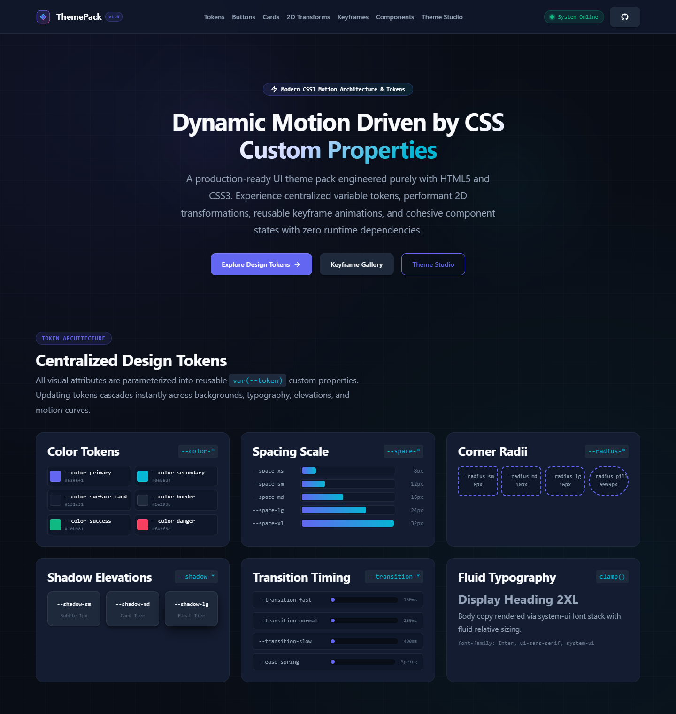
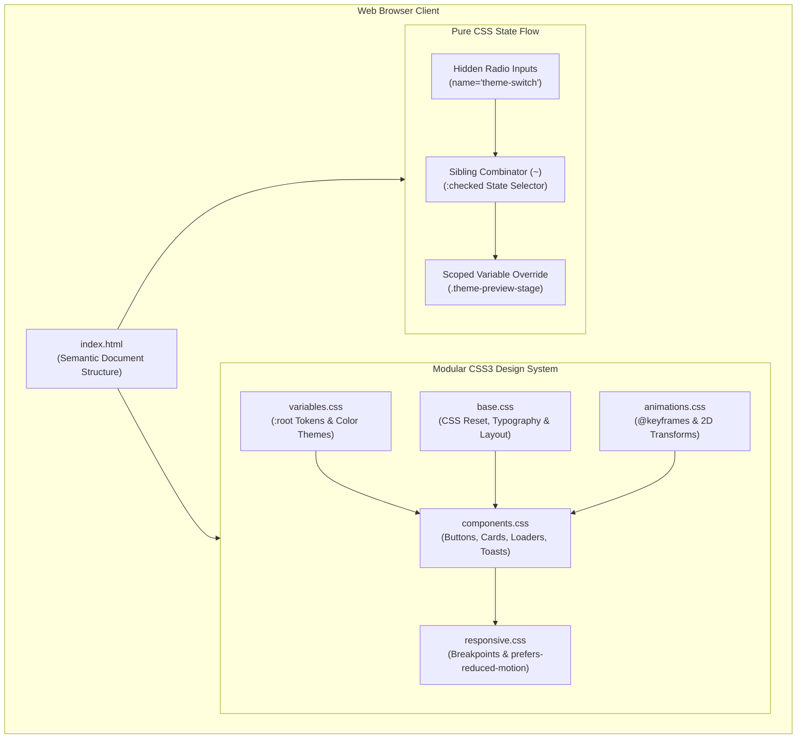
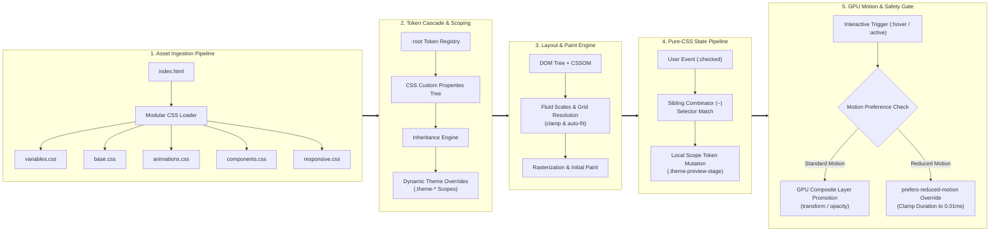

# Animated UI Theme Pack

[](https://developer.mozilla.org/en-US/docs/Web/HTML)
[](https://developer.mozilla.org/en-US/docs/Web/CSS)
[](#tech-stack)
[](#testing)
[](#features)
[](LICENSE)

A modular, high-performance UI component library and motion design system built with semantic HTML5 and modern CSS3. Demonstrates centralized CSS Custom Properties (`var(--token)`), hardware-accelerated 2D geometric transformations (`translate`, `scale`, `rotate`, `skew`), reusable `@keyframes` animations, and a zero-JavaScript interactive theme-switching mechanism. Engineered for accessibility with WCAG-compliant focus rings and OS-level `prefers-reduced-motion` handling.

---

<p align="center">
  
</p>

---

## Features

- **Centralized Design Token Architecture**: Declarative `:root` tokens for color palettes, spacing scales, border radii, elevation shadows, and cubic-bezier easing curves.
- **Zero-JavaScript Theme Studio**: Dynamic runtime theme switcher providing 4 theme variations (*Cyber Indigo*, *Emerald Forest*, *Neon Cyberpunk*, *Sunset Amber*) using radio button states and CSS sibling combinator selectors (`~`).
- **Interactive 2D Transform Playground**: Live coordinate test stages demonstrating `translateX()`, `translateY()`, `translate()`, `scale()`, `rotate()`, and `skew()`.
- **Standardized Keyframe Gallery**: 8 reusable `@keyframes` animation primitives (`fade-in`, `slide-up`, `slide-in`, `pulse`, `float`, `shimmer`, `spin`, `bounce`).
- **Surface Elevation & Motion Cards**: 6 distinct card animation implementations demonstrating Elevation Lift, Spring Scale, Subtle Tilt, Ambient Glow, Gradient Flow, and Accent Reveal.
- **Multi-State Button Matrix**: 7 functional button variants (Primary, Secondary, Outline, Ghost, Success, Danger, Disabled) featuring hover lifts, active press depression, and accessible keyboard focus outlines.
- **Micro-Interaction UI Components**: Live pulsing status badges, staggered dot pulse loaders, dual-ring spinners, skeleton shimmer cards, indeterminate progress bars, and toast notification stacks.
- **Accessible & Responsive Baseline**: Fluid typography scales via `clamp()`, flexible CSS Grid and Flexbox layouts, keyboard `:focus-visible` styling, and comprehensive `prefers-reduced-motion` overrides.
- **Zero Runtime Dependencies**: Pure HTML5 and CSS3 with no JavaScript execution, preprocessors, bundlers, or external CDN requests.

---

## Tech Stack

| Category | Technology | Implementation Details |
| :--- | :--- | :--- |
| **Markup** | HTML5 | Semantic document structure (`<header>`, `<nav>`, `<main>`, `<section>`, `<article>`, `<footer>`) |
| **Styling** | Modern CSS3 | CSS Custom Properties, 2D Transforms, Transitions, `@keyframes`, CSS Grid, Flexbox |
| **Typography** | Native Font Stack | Fluid scaling via `clamp()`, system-ui and monospace fallbacks with zero network requests |
| **Graphics** | SVG | Local vector brand mark and inline scalable icons (`assets/images/logo.svg`) |
| **Architecture** | Layered Modular CSS | 5 functional layers (`variables`, `base`, `animations`, `components`, `responsive`) |
| **Build Tools** | None | 100% native static files; no bundler, compiler, or minifier required |
| **Runtime / Backend** | None | Client-side only; zero JavaScript execution and zero external network calls |

---

## Architecture

The project employs a layered, modular CSS architecture that strictly decouples design tokens, foundational styles, keyframe motion rules, component definitions, and responsive overrides.



### Architectural Layers

1. **Token Foundation (`css/variables.css`)**: Establishes global custom properties on `:root` governing colors, spacing scales, border radii, shadows, and easing curves. Houses scoped theme classes (`.theme-emerald`, `.theme-cyber`, `.theme-sunset`, `.theme-midnight`).
2. **Document Foundation (`css/base.css`)**: Applies an accessible modern reset (`box-sizing: border-box`), fluid typography rules, dark-mode body styles, background atmosphere gradients, custom scrollbar styling, and accessible focus rings.
3. **Motion Primitives (`css/animations.css`)**: Declares atomic `@keyframes` animations and isolated 2D transform utility classes utilizing composite-only properties (`transform`, `opacity`) for smooth 60fps performance.
4. **Component Composition (`css/components.css`)**: Assembles tokens and animations into cohesive UI patterns including the site header, hero presentation, interactive buttons, animated cards, coordinate stages, loaders, status beacons, and toast alerts.
5. **Responsive & Accessibility Overrides (`css/responsive.css`)**: Implements mobile-first layout rules from 320px up to 1440px+ and defines strict animation dampening under `@media (prefers-reduced-motion: reduce)`.
6. **Master Aggregator (`css/style.css`)**: Aggregates all modular layers in cascade order via `@import`.

### Pipeline Architecture

The execution and rendering lifecycle operates through a deterministic 5-stage pipeline, processing native assets from initial ingestion to GPU-accelerated display without intermediate runtime JavaScript:



#### Pipeline Stages Detailed Breakdown

| Stage | Pipeline Phase | Trigger / Source | Mechanism / Implementation | Output / Resolution |
| :---: | :--- | :--- | :--- | :--- |
| **01** | **Asset Ingestion Pipeline** | Browser HTTP Request | Sequential `<link>` imports in [index.html](file:///c:/Users/jishn/Desktop/Animated-Ui-Theme-Pack/index.html#L12-L16) | Predictable CSS cascade order without bundle latency |
| **02** | **Token Cascade & Scoping** | `:root` Evaluation | CSS Custom Properties declared in [variables.css](file:///c:/Users/jishn/Desktop/Animated-Ui-Theme-Pack/css/variables.css#L6-L149) | Centralized design tokens inherited across all components |
| **03** | **Layout & Paint Engine** | DOM + CSSOM Binding | Fluid math (`clamp()`), CSS Grid `auto-fit`, and SVG rendering | Responsive, vector-crisp UI rendered from 320px to 4K |
| **04** | **Pure-CSS State Pipeline** | Theme Pill Selection | Radio inputs + sibling combinators (`:checked ~ .theme-preview-stage`) | Instantaneous palette re-theming with zero JS overhead |
| **05** | **GPU Motion & Safety Gate** | User Interaction / OS Flag | Composite-only properties (`transform`, `opacity`) + `prefers-reduced-motion` | 60fps tactile feedback with automated vestibular safety |

---

## Project Structure

```text
Animated-Ui-Theme-Pack/
├── .gitignore               # Excludes OS artifacts, IDE metadata, logs, and secrets
├── LICENSE                  # MIT License terms
├── README.md                # Technical documentation and architectural reference
├── index.html               # Semantic HTML5 component showcase and dashboard
├── assets/
│   └── images/
│       ├── desktop-preview.png  # High-resolution desktop showcase preview
│       └── logo.svg             # Scalable vector brand emblem
└── css/
    ├── animations.css       # Core @keyframes definitions and 2D transform utility classes
    ├── base.css             # CSS reset, typography defaults, layout containers, and focus rings
    ├── components.css       # Navigation, hero, buttons, cards, toasts, loaders, and status beacons
    ├── responsive.css       # Mobile-first media queries and prefers-reduced-motion accessibility
    ├── style.css            # Stylesheet aggregator importing all modular CSS layers
    └── variables.css        # Centralized CSS custom properties (tokens) and theme definitions
```

---

## Project Analysis

### Architecture Summary
The application is constructed entirely as a client-side, zero-dependency static web showcase. It avoids heavy JavaScript frameworks or CSS utility abstractions in favor of modern, native web standards: CSS Custom Properties, CSS Grid, Flexbox, and composite-only transitions.

### Code Organization
Styling is separated into 5 domain-specific stylesheets loaded sequentially in `index.html`. This modular structure avoids monolithic stylesheet bloat, preserves clear separation of concerns, and simplifies component maintenance.

### Main Application Flow
1. The browser requests and loads `index.html`.
2. The browser parses the head and fetches the modular CSS layers in architectural order.
3. Design tokens defined in `:root` are evaluated and inherited across all DOM nodes.
4. User interactions (`:hover`, `:active`, `:focus-visible`) trigger hardware-accelerated transforms and transitions.
5. Selecting a theme radio button triggers pure CSS sibling selectors (`#theme-emerald:checked ~ .theme-preview-stage`), instantly overriding scoped custom properties without DOM manipulation or JavaScript execution.

### Key Implementation Decisions
- **Hardware-Accelerated Motion**: High-frequency animations strictly target `transform` and `opacity` with `will-change` hints, avoiding browser layout recalculations and repaint thrashing.
- **Zero Runtime JavaScript**: Eliminates client-side script execution, parsing overhead, cross-site scripting (XSS) vectors, and dependency vulnerabilities.
- **Self-Contained Offline Execution**: Leverages native system font fallbacks and local SVG assets with zero external HTTP/CDN requests.
- **Inclusive Accessibility**: Standardizes visible keyboard focus outlines (`:focus-visible`) and neutralizes continuous motion for users with vestibular sensitivity via `@media (prefers-reduced-motion: reduce)`.

### Strengths
- Lightweight payload (<120 KB total repository size).
- Zero third-party supply-chain exposure.
- Instantaneous initial load with zero render-blocking JavaScript.
- Fluid responsiveness across viewport sizes (320px to 4K).

### Technical Considerations & Limitations
- Pure CSS theme switching is scoped to the preview stage container (`.theme-preview-stage`). Document-wide theme switching without JavaScript requires wrapping page contents inside sibling relationships or utilizing modern `:has()` selector cascades.
- Automated visual regression testing is not configured in the repository.

---

## Installation

```bash
# Clone the repository
git clone https://github.com/bhabakjishnu/Animated-Ui-Theme-Pack.git

# Navigate into the project root
cd Animated-Ui-Theme-Pack
```

---

## Environment Variables

This project is a static frontend library built purely with HTML5 and CSS3. It does not connect to external APIs, databases, or backend services, and requires **no environment variables** (`.env`).

---

## Running the Project

Because the project contains zero compilation steps and zero runtime dependencies, it runs directly in any modern web browser:

### Option A: Direct File Execution
- **Windows (PowerShell)**:
  ```powershell
  Start-Process index.html
  ```
- **macOS**:
  ```bash
  open index.html
  ```
- **Linux**:
  ```bash
  xdg-open index.html
  ```

### Option B: Local Development HTTP Server (Optional)
```bash
# Using Python 3 built-in server
python -m http.server 8000

# Using Node.js npx serve
npx serve .
```

---

## Build

No build step is required. The source code is native HTML5 and CSS3, ready for immediate static deployment to hosting environments such as GitHub Pages, Cloudflare Pages, Netlify, Vercel, AWS S3, or Nginx.

---

## Testing

Automated tests are not currently included in this repository.

Manual verification can be performed using:
1. **Viewport & Responsive Verification**: Inspect layouts across mobile (320px), tablet (768px), and desktop (1024px+) viewports.
2. **Accessibility Verification**: Tab through interactive components to ensure high-contrast `:focus-visible` focus rings appear.
3. **Motion Sensitivity Verification**: Emulate `prefers-reduced-motion: reduce` in browser developer tools (Rendering tab) to verify that animations halt gracefully.

---

## Security

Security considerations identified during the repository review are documented below. This project commits no secrets, credentials, private keys, or environment files. All assets are self-contained locally, eliminating third-party supply-chain and CDN tampering risks.

---

## Security Audit Summary

A repository-level security review was performed covering:

- **Secrets and Credentials**: Verified. No API keys, credentials, tokens, or private keys exist in source code or Git history.
- **Environment Variables**: Verified. No `.env` files are required or committed; exclusion patterns are reinforced in `.gitignore`.
- **Authentication & Authorization**: Not applicable; static showcase with no user accounts or permission gates.
- **Injection Risks**: Verified. Zero JavaScript execution, no DOM interpolation, no external untrusted input handling.
- **External Link Hygiene**: Outbound links configure `rel="noopener noreferrer"` to prevent tabnabbing.
- **Dependency Security**: Verified. Zero third-party dependencies, zero package managers, and zero supply chain vulnerabilities.
- **Configuration & Hosting**: Hardening recommendations provided below for production web servers.
- **OWASP-Oriented Risks**: Evaluated against OWASP Top 10 principles; no applicable vulnerabilities identified.

No significant issue identified during the repository-level review.

### Recommended Production Security Headers

When deploying to a production web server (Nginx, Apache, Cloudflare, Netlify, etc.), configuring the following HTTP response headers is recommended as defense-in-depth:

```http
Content-Security-Policy: default-src 'self'; style-src 'self' 'unsafe-inline'; img-src 'self' data:; font-src 'self'; base-uri 'self'; form-action 'self';
X-Content-Type-Options: nosniff
X-Frame-Options: DENY
Referrer-Policy: strict-origin-when-cross-origin
Permissions-Policy: camera=(), microphone=(), geolocation=()
```

---

## Limitations

- **No Automated Test Suite**: Automated unit and visual regression tests are not currently included in the repository.
- **Scoped Pure-CSS Theming**: Dynamic theme switching operates via sibling combinator selectors within `.theme-preview-stage` rather than across the full document body.
- **Web Server Configuration Required for Headers**: Because the repository consists of raw static files without server configuration files, HTTP security headers must be applied by the hosting environment.

---

## Future Improvements

### Architecture & Theming
- Implement modern CSS `:has()` pseudo-class selectors to enable document-wide theme switching without JavaScript.
- Integrate CSS `@container` queries for modular, component-level responsive behavior.

### Testing & Quality Assurance
- Add an automated visual regression testing workflow using Playwright or Cypress.
- Integrate automated HTML and CSS validation (e.g., HTMLHint, Stylelint) via GitHub Actions CI.

### Deployment & Tooling
- Provide production web server configuration templates (`nginx.conf`, `netlify.toml`, `_headers`).
- Add an optional asset minification build script for bandwidth optimization in high-traffic deployments.

---

## Contributing

1. Fork the repository on GitHub.
2. Create a feature branch (`git checkout -b feature/component-enhancement`).
3. Commit changes adhering to existing design token conventions (`git commit -m "feat: add pulse card variation"`).
4. Verify accessibility compliance (`prefers-reduced-motion` and `:focus-visible`).
5. Open a Pull Request with a clear description of modifications.

---

## License

This project is licensed under the [MIT License](LICENSE).

---

## Author / Project Credits

- **Repository**: [bhabakjishnu/Animated-Ui-Theme-Pack](https://github.com/bhabakjishnu/Animated-Ui-Theme-Pack)
- **Author**: Jishnu Bhabak
